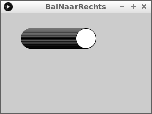
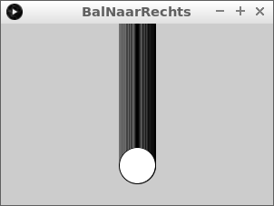
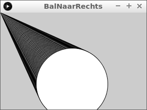

# Boll till höger

I den här lektionen ska vi göra en boll till höger.

Lär dig också i denna lektion vad en variabel är.
Du kan knappt programmera utan variabler.


\pagebreak
  
## Boll till höger: intro

Ange följande kod:

```c++
float x = 60;

void setup()
{
  size(250, 200);
}

void draw()
{
  ellipse(x, 50, 40, 30);
  x = x + 1;
}
```

Tryck sedan på 'Run'.

Om det finns röda bokstäver har du gjort ett stavfel. 
Titta noga och rätta stavfel.

Om allt går bra ser du en boll som rör sig till höger (se figur `Boll till höger: intro`).


\pagebreak

## Boll till höger: uppgift 1


Skärmen är nu 250 pixlar bred. Gör den nu 300 pixlar bred.

Ändra koden och tryck på "Run".

\pagebreak

## Boll till höger: lösning 1

Det finns en "250" i koden. Det räcker med att ändra detta till 300:

```c++
float x = 60;

void setup()
{
  size(300, 200);
}

void draw()
{
  ellipse(x, 50, 40, 30);
  x = x + 1;
}
```

 | 
:-----------------:|:-----------------------------:
`size(300, 200);`  | 'Kära dator, skapa ett fönster 300 pixlar brett och 200 pixlar högt.'

\pagebreak

## Boll till höger: uppgift 2



Bollen är nu äggformad: den är nu 40 pixlar bred och 30 pixlar hög.
Gör nu bollen rund: 40 pixlar bred och 40 pixlar hög.

\pagebreak

## Boll till höger: lösning 2

`ellips (x, 50, 40, 30);` drar bollen.
`40, 30` gör bollen äggformad.
Att göra denna till `40, 40` gör bollen rund.

```c++
float x = 60;

void setup()
{
  size(300, 200);
}

void draw()
{
  ellipse(x, 50, 40, 40);
  x = x + 1;
}
```

 | 
:----------------------:|:--------------------------------------:
`ellips (x, 50,40,30);` | 'Kära dator, rita en oval `x` pixlar till höger, `50` pixlar nedåt, vilket är `40` pixlar brett och `30` pixlar högt.'

\pagebreak

## Boll till höger: uppgift 3


Bollen rör sig nu till höger med en pixelhastighet i taget.
Låt bollen gå till höger dubbelt så snabbt

\pagebreak

## Boll till höger: lösning 3

`x = x + 1;` flyttar bollen. Ändra detta till `x = x + 2;`. Koden blir då:

```c++
float x = 60;

void setup()
{
  size(300, 200);
}

void draw()
{
  ellipse(x, 50, 40, 40);
  x = x + 2;
}
```

 | 
:-----------------:|:-----------------------------:
`x = x + 1;`| 'Kära dator, gör `x` till en högre.'
`x += 1;`   | 'Kära dator, gör `x` en högre.'
`x++;`      | 'Kära dator, gör `x` en högre.'
`++x;`      | 'Kära dator, gör `x` en högre.'

\pagebreak

## Boll till höger: uppgift 4


I början är bollens mitt 60 pixlar till höger.
Kan du också få cirkeln att börja 0 pixlar till höger?

\pagebreak

## Boll till höger: lösning 4

`float x = 60;` bestämmer detta. Ändra detta till `float x = 0;`. Koden blir då:

```c++
float x = 0;

void setup()
{
  size(300, 200);
}

void draw()
{
  ellipse(x, 50, 40, 40);
  x = x + 2;
}
```

 | 
:------------------:|:--------------------------------:
`void setup () {}` | 'Kära dator, gör vad som helst inom lockiga parenteser .'

\pagebreak

## Boll till höger: uppgift 5

Haha, den här lektionen kallas 'Boll till höger', 
men vi ska också göra en boll till vänster!


Låt nu bollen börja på höger sida av skärmen och flytta till vänster.

\pagebreak

## Boll till höger: lösning 5

För att få bollen till höger måste du använda `float x = 500;` (eller något annat högt tal).
För att få bollen att gå åt vänster måste du använda `x = x - 1;`. Koden blir då:

```c++
float x = 200;

void setup()
{
  size(300, 200);
}

void draw()
{
  ellipse(x, 50, 40, 40);
  x = x - 1;
}
```

 | 
:------------------:|:--------------------------------:
`void draw () {}` | 'Kära dator, gör vad som helst inom lockiga parenteser hela tiden.'

\pagebreak

## Boll till höger: vad är en variabel?

På den första raden använder vi en variabel:

```c++
float x = 50;
```

I klartext är detta: "Kära dator, kom ihåg talet `x` med ett börjanvärde på `50`.".

 | 
:-------------------:|:--------------------------------:
`float x = 50;` | 'Kära dator, kom ihåg talet `x` med ett börjanvärde på `50`.'

En variabel är ett datorminne med ett namn.
Datorn kan använda det namnet för att avgöra var i minnet den ska leta.
  
Variabler som tillhör dig (och nästan varje människa) är: namn, ålder,
födelsedatum, adress, telefonnummer, epostadress och mycket mer.
Om någon frågar dig i din ålder vet du vilket nummer du ska säga.

 | 
:-------------------:|:--------------------------------:
`pengar` | 'Kära dator, berätta hur mycket pengar jag har på banken.'
`1000000` | 'Jättebra!'

\pagebreak

Tillbaka till den första raden i vår kod:

```c++
float x = 50;
```

Ordet `x` är namnet på en variabel. I det här fallet hur långt cirkeln är till höger.
Ordet `float` betyder att `x` är ett (komma) tal.
Symbolen `=` betyder 'kommer att vara från och med nu'.
Talet `50` är det initiala värdet.
Semikolon (`;`) anger slutet på en mening (som punkten i en svensk text).


 | 
:-------------------:|:--------------------------------:
`float` | 'ett kommatal'
`=`     | 'ska bli nu'
`;`     | 'sluten av meningen'

\pagebreak

## Boll till höger: uppgift 6

Haha, den här lektionen kallas "Boll till höger", 
men vi kommer också att få en boll att röra sig nedåt!



 * Ändra namnet på variabeln `x` till `y`
 * Starta en boll högst upp på skärmen
 * Bollen måste vara `150` pixlar till höger
 * Bollen måste gå ner i en rak linje. Tips: bollen är nu 50 pixlar nere

\pagebreak

## Boll till höger: lösning 6

```c++
float y = 0;

void setup()
{
  size(300, 200);
}

void draw()
{
  ellipse(150, y, 40, 40);
  y = y + 1;
}
```

\pagebreak

## Boll till höger: uppgift 7


Nu ska vi få bollen att röra sig snabbare och uppåt

 * Starta en boll längst ner på skärmen
 * Bollen måste gå upp i en rak linje
 * Bollen måste gå dubbelt så snabbt

\pagebreak

## Boll till höger: lösning 7

```c++
float y = 200;

void setup()
{
  size(300, 200);
}

void draw()
{
  ellipse(150, y, 40, 40);
  y = y - 1;
}
```

\pagebreak

## Boll till höger: slutuppgift



 * bollen måste gå diagonalt till höger-ner
 * bollen måste öka i bredd och höjd
 * se även figur `slutuppgift 'Boll till höger'`

