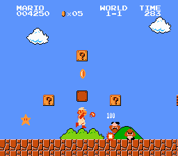

# `point` och `random`

I den här lektionen lär vi oss

 * vilka pixlar är
 * hur pixlarna sitter på en skärm
 * hur man ritar prickar
 * hur man gör slumpmässiga saker


## `point` och `random`: intro

Pixlar är rutorna som utgör din skärm.

 | Pixel = en ruta på skärmen
:-----------------:|:-----------------------------:

Ju fler pixlar skärmen har desto skarpare ser bilden ut.
Du kan se det bra med gamla spel: de har färre pixlar:



## `point` och `random`: uppgift 1

Kör följande kod:

```c++
void setup()
{
  size(300, 200);
}

void draw()
{
  point(150, 100);
}
```

 | 
:-----:|:--------------------------------------------:
`point(150, 100);` | 'Kära dator, rita en prick på pixeln som är tvåhundra pixlar till höger och hundra femtio pixlar nedåt'
`point(150, 100);` | 'Kära dator, rita en prick på koordinat' (150, 100) ''

## `point` och `random`: lösning 1


\pagebreak

## `point` och `random`: uppgift 2


Rita en andra prick mellan den första och den övre delen av fönstret.

## `point` och `random`: lösning 2

```c++
void setup()
{
  size(300, 200);
}

void draw()
{
  point(150, 100);
  point(150, 50);
}
```

## `point` och `random`: uppgift 3

Den första pixeln är exakt i mitten. Med andra ord, halva bredden på fönstret och
på halva skärmens höjd. Ändra `point(150,100);' till något med 'bredd' och 'höjd'.

## `point` och `random`: lösning 3

```c++
void setup()
{
  size(300, 200);
}

void draw()
{
  point(width / 2, height / 2);
  point(150, 50);
}
```

 | 
:-----------------:|:----------------------------- :
`width / 2` | 'Dear computer, ange här bredden på fönstret, dividerat med två'

## `point` och `random`: uppgift 4

Den andra pixeln är

  * på halva fönstret
  * på en fjärdedel av skärmens höjd

Ändra `point(150, 50);' till något med 'bredd' och 'höjd'.

## `point` och `random`: lösning 4

```c++
void setup()
{
  size(300, 200);
}

void draw()
{
  point(width / 2, height / 2);
  point(width / 2, height / 4);
}
```

 | 
:-----------------:|:----------------------------- :
`höjd / 4` | 'Kära dator, ange här fönstrets höjd, dividerat med fyra'


## `point` och `random`: uppgift 5


Rita en ny pixel i skärmens övre vänstra hörn.

\pagebreak

## `point` och `random`: lösning 5

```c++
void setup()
{
  size(300, 200);
}

void draw()
{
  point(width / 2, height / 2);
  point(width / 2, height / 4);
  point(0, 0);
}
```

 | 
:-----------------:|:----------------------------- :
`point(0,0);` | 'Kära dator, rita en prick i det övre vänstra hörnet'
`point(0,0);` | 'Kära dator, rita en prick på koordinat' (0, 0) ''

\pagebreak

## `point` och `random`: uppgift 6


Rita en ny pixel, längst upp till höger på skärmen.
Använd `bredd - 1 'som det första talet inom parentes för `point`.

## `point` och `random`: lösning 6

```c++
void setup()
{
  size(300, 200);
}

void draw()
{
  point(width / 2, height / 2);
  point(width / 2, height / 4);
  point(0, 0);
  point(width - 1, 0);
}
``` 

## `point` och `random`: uppgift 7


Rita två pixlar i de nedre två hörnen. Använd 'bredd - 1' och 'höjd - 1' på rätt ställen.

\pagebreak

## `point` och `random`: lösning 7

```c++
void setup()
{
  size(300, 200);
}

void draw()
{
  point(width / 2, height / 2);
  point(width / 2, height / 4);
  point(0, 0);
  point(width - 1, 0);
  point(0, height - 1);
  point(width - 1, height - 1);
}
```

## `point` och `random`: uppgift 8

Kör den här koden:

```c++
void setup()
{
  size(300, 200);
}

void draw()
{
  point(random(300), 100);
}
```

Vad ser du?

\pagebreak

## `point` och `random`: lösning 8


Du ser att prickar dras på slumpmässiga platser, men alltid på samma höjd.

 | 
:-----------------:|:----------------------------- :
`random (300)` | 'Kära dator, välj ett slumpmässigt tal från noll till tre hundra'

## `point` och `random`: uppgift 9


```c++
void setup()
{
  size(400, 100);
}

void draw()
{
  point(random(width), height / 2);
}
```

## `point` och `random`: final command


Låt datorn rita prickar slumpmässigt genom fönstret.

