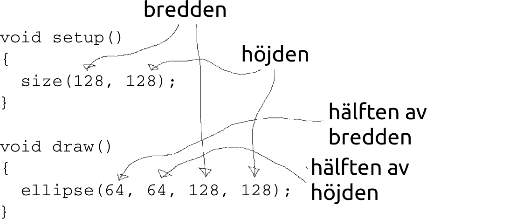

# `width` och `height`

I den här lektionen lär du dig användar `width` och `height`.


\pagebreak

## `width` en `height`: intro

```c++
void setup() 
{
  size(256, 256);
}

void draw()
{
  ellipse(128, 128, 256, 256);  
}
```

| 
:---------------------:|:-----------------------------:
`size(800, 400);`      | 'Kära dator, gör ett fönster `800` pixlar brett och `400` pixlar högt.'
`ellips (60,50,40,30);`| 'Kära dator, rita en oval `60` pixlar till höger, `50` pixlar nedåt, som är `40` pixlar breda och `30` pixlar höga'

Skriv in koden ovan och kör den.


## `width` och `height`: uppgift 1


Gör nu fönstret 128 x 128 pixlar litet.

\pagebreak

## `width` och `height`: lösning 1

```c++
void setup() 
{
  size(128, 128);
}

void draw()
{
  ellipse(64, 64, 128, 128);  
}
```

## `width` och `height`


`width` och `height` är inbyggda i bearbetning,
så att ditt program fortfarande fungerar när du ändrar storlek på skärmen.

Nu fungerar våra program bara för en skärm av en viss storlek.
Varje gång du väljer en ny storlek måste du skriva in mycket kod igen!

Om vi vet skärmens bredd och höjd vet vi också vilka siffror som ska vara i ellips:

 * ovalens x-koordinat är halva bredden
 * y-koordinaten för ovalen är halva höjden
 * ovalens bredd är skärmens bredd
 * höjden på ovalen är skärmens höjd



Bearbetningen känner till skärmens bredd och höjd:
Skärmens bredd kallas `width` och höjden kallas `height`

 | 
:-----------------:|:-----------------------------:
`width` | 'Kära dator, ange här hur många pixlar fönstret är brett.'
`height`| 'Kära dator, ange här hur många pixlar fönstret är högt.'

Dessa siffror bestäms när du använder storlek för att definiera storleken på din skärm.

\pagebreak

## `width` och `height`: uppgift 2


Skapa ett program som ritar en oval som fyller skärmen:

 * Ändra den första `64` till `width / 2`
 * Ändra den andra `64` till `height / 2`
 * Ändra den första `128` till `width`
 * Ändra den andra `128` till `height`

| 
:-----------------:|:-----------------------------:
`/` | 'dividerat med', en delningsrad som du har med bråk, `:`

\pagebreak

## `width` och `height`: lösning 2

```c++
void setup() 
{
  size(128, 128);
}

void draw()
{
  ellipse(width / 2, height / 2, width, height);  
}
```

## `width` och `height`: uppgift 3


Ställ in cirkelns mitt för att koordinera `(0, 0)`.

\pagebreak

## `width` och `height`: lösning 3

```c++
void setup() 
{
  size(128, 128);
}

void draw()
{
  ellipse(0, 0, width, height);  
}
```

## `width` och `height`: uppgift 4


Skapa en andra cirkel centrerad i det övre högra hörnet.
Använd `width` och/eller `height`.

\pagebreak

## `width` och `height`: lösning 4

```c++
void setup() 
{
  size(128, 128);
}

void draw()
{
  ellipse(0, 0, width, height);  
  ellipse(width, 0, width, height);  
}
```

## `width` och `height`: uppgift 5


Gör en tredje cirkel centrerad i nedre vänstra hörnet.
Använd `width` och/eller `height`.

\pagebreak

## `width` och `height`: lösning 5

```c++
void setup() 
{
  size(128, 128);
}

void draw()
{
  ellipse(0, 0, width, height);  
  ellipse(width, 0, width, height);  
  ellipse(0, height, width, height);  
}
```

## `width` och `height`: sista kommandot


 * Gör fönstret 300 pixlar brett och 200 pixlar högt
 * Gör en fjärde cirkel centrerad i nedre högra hörnet
 * Gör en femte cirkel som är i mitten och är dubbelt så liten
 * Använd `width` och/eller `height` (ingen `100`, `150`,`200` eller `300`!)

